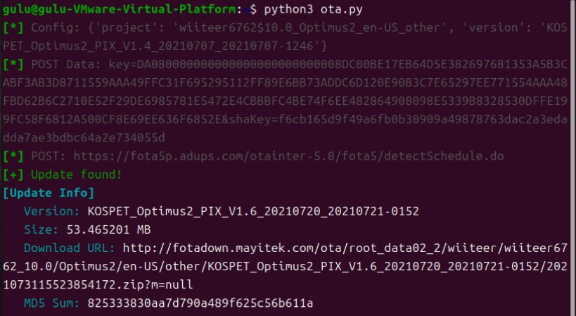

`com.adups.fota`

Depends on the following properties
 
  * 
    ````
    ro_fota_oem
    ro_fota_device
    ro_product_locale
    ro_operator_optr
    ro_fota_version
    ````
 You can use this adb command to get
       
       
    adb shell getprop
### Get Started
The script requires Python environment and tbm13-utils package, you can install it using pip

 ```
pip install tbm13-utils
 ```
Running scripts using Python3
```
python3 ota.py
 ```
 


 * According to the  `ro_fota_version ` attribute, the server provides ota.zip to upgrade from the current device version to the latest version
   
* If your   `ro_fota_version `  is too old, the server will most likely not return updates because the manufacturer has stopped supporting the device.
* To patch images, extract the OTA zip and use [imgpatchtools tools](https://github.com/erfanoabdi/imgpatchtools).

### Off topic: According to laboratory research, “adups” collect a large amount of user privacy indiscriminately
* Send encrypted cell site ID, MCC, MNC, IMEI, IMSI, MAC address, SIM serial number, phone number, and other device data to the server every 24 hours
* dc_app_flow.json – the order in which the user uses their applicaNons  
dc_msg_key.json - all text message send or received by the device with Nmestamps  
DcApp.json - list of applicaNons installed on the device  
DcAppOp.json - AppOps data (granted and denied permission)  
DcMobileStatus.json - minimal device diagnosNc data  
DcRootInfo.json - file lisNng of /system/bin and /system/xbin directories  
DcTellMessage.json - the user’s call log and text metadata with Nmestamps  
dc_browser_his.json - the user’s browser history
* Exploit the vulnerability to extract and further obtain device information
* ........

You can choose to disable com.adups.fota, which keeps sending requests to the server and reduces battery life.
